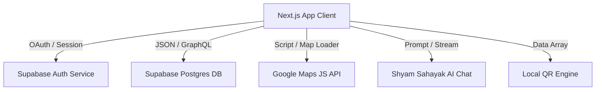

# Frontend Specification & Design System Document
## Smart Pilgrim Management System — Khatu Shyam Ji

As the Senior UI/UX Designer and Frontend Architect, this document specifies the visual foundations, component architectures, layout systems, and integration interfaces for the Smart Pilgrim Management System.

---

## 🎨 1. Design System (Tokens & Visual Theme)

The application employs a **traditional-premium devotional theme** blending rich Indian temple cultural accents with contemporary glassmorphism and smooth, physics-based micro-animations.

### 1.1 Color Palette
The color tokens are structured to represent different states, roles, and cultural motifs.

| Token Name | Hex Code | Tailwind / HSL Equivalent | Primary Usage |
| :--- | :--- | :--- | :--- |
| **Temple Maroon** | `#800000` | `bg-[#800000]` / `hsl(0, 100%, 25%)` | Primary brand color, headers, primary buttons, sacred highlights. |
| **Sacred Saffron** | `#E25822` | `bg-[#E25822]` / `hsl(17, 78%, 51%)` | Dynamic gradients, action triggers, warnings. |
| **Gold Accent** | `#D4AF37` | `text-[#D4AF37]` / `hsl(46, 65%, 52%)` | Borders, ornaments, stars, rating highlights, selection rings. |
| **Ivory Base** | `#FAF6F0` | `bg-[#FAF6F0]` / `hsl(36, 33%, 96%)` | Main app background, drawer containers. |
| **Warm Sand** | `#FAF0E4` | `bg-[#FAF0E4]` / `hsl(33, 56%, 94%)` | Content card backgrounds, secondary borders, subheaders. |
| **Baba Charcoal** | `#1A120B` | `text-[#1A120B]` / `hsl(30, 40%, 7%)` | Primary text, titles, deep background blocks. |
| **Clay Brown** | `#6B5440` | `text-[#6B5440]` / `hsl(28, 25%, 34%)` | Secondary body text, icon fills, placeholder text. |
| **Divine Emerald** | `#216A37` | `bg-[#216A37]` / `hsl(138, 52%, 27%)` | Status: Available, successful booking, safe crowd indicators. |
| **Alert Amber** | `#9A5A13` | `bg-[#9A5A13]` / `hsl(32, 77%, 34%)` | Status: Moderately full, warning alerts, queue warning logs. |

### 1.2 Typography
The typographic scale emphasizes cross-lingual legibility, balancing Latin headers with Devanagari script.

- **Headings (Latin):** **Cinzel** (Google Fonts)
  - *Weights:* `700` (Bold), `800` (Extra Bold), `900` (Black)
  - *Fallback:* `Georgia, serif`
  - *Visual Characteristic:* Traditional serif proportions conveying sacred permanence and regality.
- **Headings (Devanagari):** **Noto Serif Devanagari** (Google Fonts)
  - *Weights:* `500` (Medium), `600` (Semi-Bold), `700` (Bold)
  - *Visual Characteristic:* Clear stroke dynamics optimal for reading temple terms in Hindi.
- **Body & System UI:** **Inter** (Google Fonts)
  - *Weights:* `400` (Regular), `500` (Medium), `600` (Semi-Bold), `700` (Bold)
  - *Fallback:* `sans-serif`
  - *Visual Characteristic:* Highly readable neutral geometric sans-serif for numbers, tables, forms, and alerts.

---

## 🧱 2. UI Component Blueprints

### 2.1 Buttons
Buttons feature dynamic hover actions, scaling animations, and clear focus states.

#### Primary Action Button
- **Styling:** `bg-gradient-to-r from-[#800000] to-[#E25822] text-white shadow-[0_4px_15px_rgba(128,0,0,0.25)] hover:shadow-[0_6px_20px_rgba(128,0,0,0.35)] transition-all duration-300 rounded-2xl font-bold py-4 px-6 relative overflow-hidden`
- **Animation (Framer Motion):**
  - Hover: `scale: 1.02`
  - Tap: `scale: 0.98`
  - Transition: `type: "spring", stiffness: 400, damping: 15`

#### Secondary Outline Button
- **Styling:** `border border-[#FAF0E4] bg-[#FAF6F0]/20 text-[#6B5440] hover:bg-[#FAF0E4] hover:text-[#800000] hover:border-[#D4AF37]/50 rounded-2xl font-bold py-3.5 px-6 transition duration-300`

### 2.2 Input Fields
Form elements are optimized for tactile click states on mobile screens (minimum tap height: `48px`).

- **Rounded Text/Number Input:**
  - **Structure:** Wrapper `div` with absolute icon placements.
  - **Styling:** `w-full rounded-2xl border border-[#FAF0E4] bg-white py-4 pl-11 pr-4 text-sm font-semibold text-[#1A120B] shadow-inner outline-none transition duration-300 focus:border-[#800000] focus:ring-4 focus:ring-[#800000]/10 placeholder-[#6B5440]/30`
- **Flag Phone Selector:**
  - Standardized custom input containing a prefix block displaying the country flag (`🇮🇳`), code (`+91`), and vertical line separator. Text input padding-left is locked at `pl-28`.

### 2.3 Cards & Modals
- **Glassmorphic Cards:**
  - **Styling:** `rounded-3xl border border-white/60 bg-white/80 shadow-[0_8px_30px_rgb(0,0,0,0.04)] backdrop-blur-md p-6 relative overflow-hidden`
- **Temple Modals / Bottom Sheets:**
  - **Overlay:** `fixed inset-0 bg-[#1A120B]/60 backdrop-blur-sm z-50`
  - **Drawer (Mobile):** Slide-up sheet from bottom with `rounded-t-3xl bg-white p-6 max-h-[85vh] overflow-y-auto`
  - **Ornamentation:** Centered gold border divider with a rotating Diamond character: `<Ornament />` wrapper.

---

## 📏 3. Spacing & Layout Structure

The layout is built mobile-first, optimizing for standard mobile viewport heights (`100dvh`).

### 3.1 Mobile Grid & Viewport
- **Container limits:** Maximum width bounded at `480px` (`max-w-md`) and centered horizontally (`mx-auto`) on desktop screens to emulate a native mobile app shell.
- **SafeArea Margins:** Standard horizontal padding uses `px-6` (24px) for screens, and `px-4` (16px) for embedded nested lists.
- **Grid Gap Scale:**
  - Compact (status elements, tags): `gap-2` (8px)
  - Standard (form entries, list items): `gap-4` (16px)
  - Section dividers: `gap-6` (24px)

---

## 🔌 4. API & Integration Specification

This section documents the integration protocols for all external systems utilized by the application.



### 4.1 Supabase Authentication Service

#### A. Mobile OTP Sign-in / Verification
- **Purpose:** Fast mobile authentication for pilgrims.
- **Authentication Initiation Endpoint:**
  - **URL:** `POST https://<project>.supabase.co/auth/v1/otp`
  - **Headers:**
    - `apikey`: `<SUPABASE_ANON_KEY>`
    - `Content-Type`: `application/json`
  - **Request Payload:**
    ```json
    {
      "phone": "+919876543210",
      "channel": "sms"
    }
    ```
  - **Response (200 OK):**
    ```json
    {
      "message_id": "sms-message-uuid"
    }
    ```
- **OTP Verification Endpoint:**
  - **URL:** `POST https://<project>.supabase.co/auth/v1/verify`
  - **Headers:** Same as above
  - **Request Payload:**
    ```json
    {
      "phone": "+919876543210",
      "token": "123456",
      "type": "sms"
    }
    ```
  - **Response (200 OK):**
    ```json
    {
      "access_token": "jwt-session-token",
      "refresh_token": "jwt-refresh-token",
      "user": {
        "id": "user-uuid",
        "phone": "+919876543210",
        "aud": "authenticated"
      }
    }
    ```

#### B. Google OAuth Integration
- **Purpose:** Secure single-sign-on (SSO) with devotee profile extraction.
- **Provider Initiation Endpoint:**
  - **URL:** `GET https://<project>.supabase.co/auth/v1/authorize?provider=google&redirect_to=http://localhost:3000/auth/callback`
  - **Response:** Redirects browser to Google Authentication consent screen.
  - **Callback Redirect Data:** Google returns query parameters containing access tokens/hashes back to the application's callback component (`/auth/callback`).

---

### 4.2 Database & Data Synchronization Services

All requests are mapped via Supabase PostgREST client interfaces to PostgreSQL.

#### A. Fetch / Verify Devotee Profile
- **Endpoint:** `GET https://<project>.supabase.co/rest/v1/profiles?id=eq.user-uuid&select=*`
- **Headers:**
  - `apikey`: `<SUPABASE_ANON_KEY>`
  - `Authorization`: `Bearer <jwt-session-token>`
- **Response (200 OK):**
  ```json
  [
    {
      "id": "user-uuid",
      "name": "Nand Kumar",
      "phone": "+919876543210",
      "email": "nand.kumar@gmail.com",
      "photo_url": "https://lh3.googleusercontent.com/a/avatar-id",
      "city": "Jaipur",
      "provider": "google",
      "created_at": "2026-07-06T10:00:00Z",
      "last_login": "2026-07-06T10:45:00Z"
    }
  ]
  ```

#### B. Insert/Create Devotee Profile (On-First-Login)
- **Endpoint:** `POST https://<project>.supabase.co/rest/v1/profiles`
- **Headers:**
  - `apikey`: `<SUPABASE_ANON_KEY>`
  - `Authorization`: `Bearer <jwt-session-token>`
  - `Content-Type`: `application/json`
  - `Prefer`: `return=representation`
- **Request Payload:**
  ```json
  {
    "id": "user-uuid",
    "name": "Nand Kumar",
    "phone": "+998765432109",
    "email": "nand.kumar@gmail.com",
    "photo_url": "https://lh3.googleusercontent.com/a/avatar-id",
    "city": "",
    "provider": "google"
  }
  ```
- **Response (201 Created):** Returns the inserted profile structure.

#### C. Create Darshan Pass Booking
- **Endpoint:** `POST https://<project>.supabase.co/rest/v1/darshan_bookings`
- **Headers:** Same as above
- **Request Payload:**
  ```json
  {
    "profile_id": "user-uuid",
    "booking_number": "KSJ-2026-8743",
    "booking_type": "group",
    "booking_date": "2026-07-08",
    "day_name": "Wednesday",
    "visitor_count": 3,
    "group_name": "Nand Family",
    "status": "upcoming"
  }
  ```
- **Response (201 Created):** Returns booking record containing the database-assigned `id` parameter.

#### D. Fetch Live Parking Status
- **Endpoint:** `GET https://<project>.supabase.co/rest/v1/parking_blocks?select=id,name,total_slots,occupied_slots,status`
- **Response (200 OK):**
  ```json
  [
    {
      "id": "block-uuid",
      "name": "Toran Dwar Parking A",
      "total_slots": 150,
      "occupied_slots": 87,
      "status": "active"
    }
  ]
  ```

---

### 4.3 Google Maps & Geo-Location API
- **Purpose:** Used on **Shyam Path** and **How to Reach** screens for tracking pilgrimage navigation paths, identifying key facilities, and calculating walking distances.
- **Script Bootstrapper Endpoint:**
  - **URL:** `GET https://maps.googleapis.com/maps/api/js?key=<GOOGLE_MAPS_API_KEY>&libraries=places`
  - **Loader Integration:** Managed on client via `@googlemaps/js-api-loader`.
- **Maps API Interface usages:**
  - `google.maps.Map`: Draws the map view.
  - `google.maps.Marker` / `google.maps.marker.AdvancedMarkerElement`: Renders custom temple markers, water stations, toilets, and shoe centers.
  - `google.maps.DirectionsService` & `google.maps.DirectionsRenderer`: Computes walking directions along designated pilgrim paths.

---

### 4.4 Cryptographic QR Code Generator
- **Purpose:** Client-side generation of scannable QR passes for ticket verification.
- **Provider Library:** `qrcode` (local compilation).
- **Execution Payload Input:**
  - Passes a string representation containing critical booking fields:
    `"KSJ-PASS-VERIFY:booking_number=<BOOKING_NUM>;holder=<NAME>;date=<DATE>;visitors=<COUNT>"`
- **Output:** Encodes data array as a base64 Data URI string injected directly into the HTML `` tag target.

---

### 4.5 Shyam Sahayak AI Chatbot API
- **Purpose:** Answers devotee queries about temple schedules, pathways, and guidelines.
- **Local API Proxy Endpoint:**
  - **URL:** `POST /api/chat/shyam-sahayak`
  - **Headers:**
    - `Content-Type`: `application/json`
  - **Request Payload:**
    ```json
    {
      "messages": [
        { "role": "user", "content": "What are the timings for Sandhya Aarti?" }
      ]
    }
    ```
  - **Response (200 OK / Server-Sent Events stream):**
    ```json
    {
      "role": "assistant",
      "content": "The Sandhya Aarti timings at Baba Khatu Shyam Ji temple generally occur between 6:30 PM and 7:15 PM depending on seasonal shifts..."
    }
    ```
