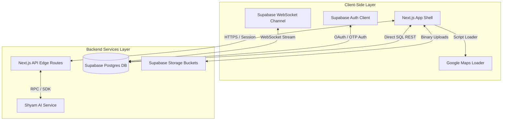

# Technical Architecture Document
## Smart Pilgrim Management System — Khatu Shyam Ji

This document outlines the architectural blueprints, database schemas, component structures, security models, and external integrations for the Smart Pilgrim Management System.

---

## 🛠️ 1. Technology Stack & Architectural Decision Record

To support high-concurrency peak usage (such as during monthly *Ekadashi* or annual *Phalguna Mela* festivals) and deliver a premium experience, the application uses a decoupled serverless SaaS architecture.



### 1.1 Tech Stack Choices & Reasoning

- **Next.js (App Router, Version 16) & React 19:**
  - *Reasoning:* Next.js App Router provides Server-Side Rendering (SSR) for static informational pages (SEO optimization for guidelines/timings) alongside client-side React code for interactive single-page application tabs. Next.js API Routes provide an edge-optimized backend handler.
- **Supabase (PostgreSQL, Auth, Storage, Realtime):**
  - *Reasoning:* Replaces a traditional heavy backend.
    - *PostgreSQL:* Offers enterprise-grade relational modeling with strict schemas.
    - *Realtime Engine:* Leverages PostgreSQL's logical replication to broadcast changes (crowd levels, parking spots) to clients instantly via WebSockets without database polling.
    - *Storage:* Manages devotee image uploads (Lost & Found reports) via secured CDN endpoints.
- **TypeScript:**
  - *Reasoning:* Prevents run-time errors across complex passenger structures, booking statuses, and config states.
- **Tailwind CSS v4 & Framer Motion:**
  - *Reasoning:* Tailwind v4 compiles faster and utilizes modern CSS custom properties. Framer Motion provides lightweight, physics-based micro-animations that make screen transitions feel premium.
- **Google Maps API:**
  - *Reasoning:* Standard vector map rendering with robust geocoding, places, and direction calculation services.

---

## 📁 2. Workspace File & Folder Directory Structure

```bash
KhatuShyamji/
├── app/                          # Next.js App Router root
│   ├── api/                      # Next.js Serverless API endpoints
│   │   └── [[...route]]/         # Hono API router for edge endpoints
│   │       └── route.ts          # Root API route controller (Supabase admin/client bindings)
│   ├── auth/                     # Authentication callback pages
│   │   └── callback/             # Client OAuth callback handler
│   │       └── page.tsx          # Syncs profile, handles redirects
│   ├── globals.css               # Global stylesheets, Tailwind imports & CSS custom properties
│   ├── layout.tsx                # App Root layout (loads fonts, wraps contexts)
│   └── page.tsx                  # Mounts AppShell (Root SPA renderer)
├── components/                   # React UI Components
│   ├── admin/                    # Admin workspace dashboards and screens
│   │   ├── admin-workspace.tsx   # Admin primary navigation shell
│   │   └── screens/              # Individual admin control screens
│   │       ├── admin-login.tsx   # Admin verification interface
│   │       └── emergency-ops.tsx # Emergency alert controls
│   ├── features/                 # Discrete app feature components
│   │   └── opening-animation.tsx # Entrance splash animation
│   ├── screens/                  # Individual client application screens
│   │   ├── auth/                 # Devotee authorization views (login, signup, otp)
│   │   ├── book-darshan.tsx      # Solo/Group Darshan booking wizard
│   │   ├── parking.tsx           # Live parking status view
│   │   ├── lost-found.tsx        # Lost & Found listings/reports
│   │   ├── profile.tsx           # User settings, Google linking, and logs
│   │   ├── qr-pass.tsx           # Renders digital QR passes
│   │   └── shyam-sahayak.tsx     # AI guide chat client
│   ├── shared/                   # Common layout blocks
│   │   └── shared.tsx            # Custom Icons, status pills, and visual ornaments
│   └── ui/                       # Primitive interface elements (buttons, inputs)
├── lib/                          # Application state, helpers, data models
│   ├── contexts/                 # Global Context Providers (LanguageContext, AudioContext)
│   ├── supabase.ts               # Instantiates Supabase Client & Supabase Admin instances
│   ├── data.ts                   # Static data and assets lists
│   └── utils.ts                  # Class merger helpers (clsx, tailwind-merge)
├── supabase/                     # Supabase Project settings
│   ├── migrations/               # Local migration SQL scripts
│   │   └── complete_schema.sql   # Consolidated schema structure
│   └── config.toml               # Supabase CLI settings
├── public/                       # Static media files (logos, watermarks, images)
├── schema.sql                    # Production blueprint schema reference
├── package.json                  # Dependencies configuration
└── tsconfig.json                 # TypeScript compiler configuration
```

---

## 🗄️ 3. Database Schema Blueprint (Plain-English Details)

The database schema is relational, utilizing foreign key constraints and Row-Level Security (RLS) policies.

```
                  ┌──────────────┐
                  │  auth.users  │
                  └──────┬───────┘
                         │ 1:1
        ┌────────────────┴───────────────┐
        │                                │
 ┌──────▼──────┐                  ┌──────▼──────┐
 │  profiles   │                  │   admins    │
 └──────┬──────┘                  └──────┬──────┘
        │ 1:N                            │ 1:N
 ┌──────┴───────────┐             ┌──────┴─────────────┐
 │ darshan_bookings │             │ admin_roles_bridge │
 └──────┬───────────┘             └──────┬─────────────┘
        │ 1:N                            │ N:1
 ┌──────┴───────────────────┐     ┌──────▼──────┐
 │ darshan_booking_members  │     │    roles    │
 └──────────────────────────┘     └─────────────┘
```

### 3.1 Tables & Schema Structure

#### A. Users & Profiles (`public.profiles`)
- **Purpose:** Holds pilgrim profile attributes linked to Supabase's authentication records.
- **Attributes:**
  - `id` (UUID, Primary Key): References the authenticated Supabase user (`auth.users.id`).
  - `name` (text, Not Null): Full name of the devotee.
  - `phone` (text, Unique, Not Null): Devotee's mobile number.
  - `email` (text, Nullable): Email address (synced from Google OAuth).
  - `photo_url` (text, Nullable): Avatar image link.
  - `provider` (text, Nullable): Auth method, defaults to `'google'` for OAuth accounts.
  - `city` (text, Nullable): Location city.
  - `created_at` / `updated_at` (timestamp, Not Null): Tracking dates.
  - `last_login` (timestamp, Nullable): Recorded login timestamp.

#### B. Administrative Panel Accounts (`public.admins` & `public.roles`)
- **Purpose:** Stores administrative user profiles and assigns permissions.
- **Attributes (`admins`):**
  - `id` (UUID, Primary Key): Assigned unique identifier.
  - `auth_user_id` (UUID, Nullable): Connects to the authenticated user table.
  - `admin_code` (text, Unique, Not Null): Assigned admin code (e.g. `ADM-001`).
  - `name` (text, Not Null): Administrator's name.
  - `phone` (text, Not Null): Contact number.
  - `email` (text, Unique, Not Null): Admin email.
  - `is_active` (boolean, Defaults true): Active state toggle.
  - `last_login` (timestamp, Nullable): Last login time.
- **Attributes (`roles`):**
  - `key` (text, Primary Key): Role code (e.g. `system_admin`, `hotel_mgr`, `parking_op`).
  - `name` (text, Not Null): Readable title.
- **Attributes (`admin_roles_bridge`):**
  - Maps `admin_id` to `role_key` to support multi-role assignments.

#### C. Ticket Booking System (`public.darshan_bookings` & `public.darshan_booking_members`)
- **Purpose:** Manages pilgrim pass tickets and details of individual visitors.
- **Attributes (`darshan_bookings`):**
  - `id` (UUID, Primary Key): Unique booking identifier.
  - `profile_id` (UUID, Foreign Key): References `profiles.id`.
  - `booking_number` (text, Unique, Not Null): Generated ticket number (e.g., `KSJ-2026-8743`).
  - `booking_type` (text, Not Null): Either `'solo'` or `'group'`.
  - `booking_date` (date, Not Null): Date of visit.
  - `visitor_count` (integer, Not Null): Number of people covered.
  - `group_name` (text, Nullable): Optional family/group name.
  - `status` (text, Not Null): `'upcoming'`, `'completed'`, or `'cancelled'`.
- **Attributes (`darshan_booking_members`):**
  - `id` (bigint, Primary Key): Incremental index.
  - `booking_id` (UUID, Foreign Key): References parent `darshan_bookings.id` on delete cascade.
  - `name` (text, Not Null): Individual visitor's name.
  - `age` (integer, Not Null): Visitor's age.
  - `gender` (text, Not Null): Visitor's gender.
  - `relationship` (text, Nullable): Relationship to the primary profile.
  - `identity_proof_type` (text, Not Null): ID type (Aadhaar, PAN, Voter ID).
  - `identity_proof_number` (text, Not Null): ID document code.

#### D. Infrastructure Control (`public.parking_blocks` & `public.traffic_updates`)
- **Purpose:** Stores parking slot counts and gate traffic levels.
- **Attributes (`parking_blocks`):**
  - `id` (UUID, Primary Key): Unique identifier.
  - `name` (text, Not Null): Parking block name.
  - `total_slots` (integer, Not Null): Total capacity.
  - `occupied_slots` (integer, Not Null): Active occupancy.
  - `status` (text, Not Null): `'active'`, `'maintenance'`, or `'closed'`.

---

## 🔒 4. Row-Level Security (RLS) Policies

All database tables must restrict read/write permissions depending on user roles.

- **Profiles Table (`public.profiles`):**
  - `SELECT`: Allowed if authenticated user's ID matches the profile ID: `auth.uid() = id`.
  - `INSERT` / `UPDATE`: Allowed only if the authenticated user's ID matches: `auth.uid() = id`.
  - `DELETE`: Prohibited.
- **Darshan Bookings Table (`public.darshan_bookings`):**
  - `SELECT`: Allowed if `auth.uid() = profile_id` (user can see their own passes).
  - `INSERT`: Allowed if `auth.uid() = profile_id`.
  - `UPDATE` / `DELETE`: Restricted to administrators.
- **Parking Blocks & Infrastructure tables:**
  - `SELECT`: Allowed for all users (public read access).
  - `INSERT` / `UPDATE` / `DELETE`: Allowed only for authenticated administrators (`auth.uid()` mapped to an active role).

---

## ⚙️ 5. Configuration & Environment Settings

The following keys must be defined in `.env.local` for the application to compile and function:

```env
# Supabase Project Credentials (Client & Server Access)
NEXT_PUBLIC_SUPABASE_URL=https://<project-ref>.supabase.co
NEXT_PUBLIC_SUPABASE_ANON_KEY=eyJhbGciOiJIUzI... (Public access token)
SUPABASE_SECRET_KEY=eyJhbGciOiJIUzI1Ni... (Service Role token - bypasses RLS, server only)

# Google Maps API Configuration
NEXT_PUBLIC_GOOGLE_MAPS_API_KEY=AIzaSy... (API Key with Maps, Places, and Directions enabled)

# Application Flags
NEXT_PUBLIC_DEV_MODE=false # Disable to enforce real production OTP/OAuth paths
```

### Production Build & Deployment Guidelines
1. **JWT Verification:** Set up the Supabase JWT secret on your hosting provider (e.g. Vercel) to match the project database secret key.
2. **CORS Configuration:** Configure Allowed Origins in Supabase Auth Settings to include both the local port (`http://localhost:3000`) and the Vercel production domain (`https://khatu-shyamji-opal.vercel.app`).
3. **Database Caches:** Execute `NOTIFY pgrst, 'reload schema';` whenever modifying the PostgreSQL structure to refresh Supabase PostgREST models instantly.
